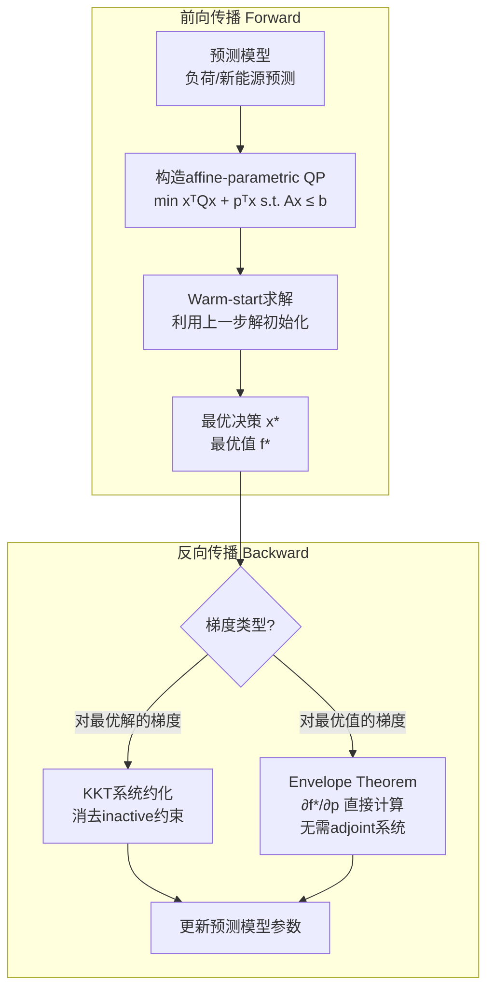

# DiffAPQP: Structured Differentiable Optimization for Decision-focused Learning in Power Systems

> 📅 创建日期: 2026-08-07
> 🏷️ #Decision-Focused-Learning #经济调度 #QP微分 #电力系统优化 #端到端学习
> ⭐ 价值评分: 9/10
> 📚 来源: [arXiv:2608.04189](https://arxiv.org/abs/2608.04189)

---

## 📌 解决了什么问题

Decision-focused learning（DfL）的核心思想是"预测不准没关系，只要最终决策好就行"——但把它用在真实电力系统（如IEEE 118节点24时段经济调度）时，每次训练迭代都要解一个大QP然后反传KKT梯度，又慢又吃内存。这篇提出了DiffAPQP，把端到端训练加速3-6倍、内存减半。

## 🧠 核心方法（方法论解读）

### 整体思路

传统的"预测→优化"是两阶段的：先用ML模型预测（比如负荷、新能源出力），再把预测值喂给优化求解器。问题是ML模型不知道自己的预测偏差会让下游决策变差多少——它只关心预测误差（MSE），不关心决策成本。

**DfL的思路**：把优化问题也嵌到训练里。前向：预测 → 解QP得最优决策 → 算真实运营成本。反向：算运营成本对预测的梯度 → 更新预测模型。问题在于反向传播要穿过QP求解器，涉及对KKT系统求导，复杂度O(n³)级别。

**DiffAPQP的加速秘诀有三招**：

1. **前向加速**：自动把CVXPY写的电力系统模型标准化为affine-parametric QP格式，利用训练中QP结构重复求解的特性做warm-start和solver-data update（每次迭代QP的矩阵结构不变，只变参数向量）
2. **反向加速-核心idea**：KKT系统里有很多对偶变量对应的是inactive约束（没被触发的）。DiffAPQP证明这些约束可以从KKT里消去，得到一个小得多的约化系统。对"最优值函数"的梯度，进一步用包络定理（Envelope Theorem）直接求，连adjoint KKT都不用解
3. **开源实现**：Python包，兼容CVXPY，即插即用

### 算法/模型框架

### 关键创新点

1. **KKT约化** — 证明可以安全消去inactive不等式约束对应的对偶变量，显著减少反向传播计算量（这是他们第一个证明的）
2. **Envelope Theorem梯度** — 当loss只依赖QP最优值（而非最优解的具体分量）时，梯度可以直接套包络定理，完全避开解adjoint KKT
3. **Solver-flexible设计** — 不绑定特定求解器，通过CVXPY自动canonicalization支持SCS、Clarabel等多个backend
4. **首个IEEE 118节点DfL验证** — 之前没人能在这么大系统上做端到端训练的counterfactual评估

### 与已有方法的区别

| 方法 | 思路 | 局限性 |
|------|------|--------|
| CvxpyLayers | 用隐函数定理对QP的KKT求导 | 完整KKT系统求导，O(n³)，大系统中太慢 |
| OptNet | 专门设计的可微QP求解器 | 需要特定求解器，灵活性差 |
| 两阶段（predict-then-optimize） | 先预测，再优化 | 预测不懂决策代价，次优 |
| 本论文 DiffAPQP | KKT约化+Envelope Theorem+Warm-start | 仅适用于affine-parametric QP |

---

## 🔬 实验设计

- **数据集**: IEEE 118-bus系统，24时段耦合经济调度+再调度
- **基线方法**: CvxpyLayers（SOTA DfL框架）、传统两阶段方法
- **评价指标**: 训练速度（min/epoch）、内存占用、最终运营成本
- **主要结果**:
  - 训练加速：2.27×-3.58×（closed-loop），3.62×-4.38×（counterfactual）
  - 最优solver配置下：3.91×加速（38.65→9.55 min/epoch）和6.39×加速（10.73→1.68 min/epoch）
  - 内存减半（≈50%）
  - 最终运营成本与CvxpyLayers持平（即加速不牺牲质量）

---

## 💡 为什么值得关注

如果你做电力系统优化+机器学习的交叉，这篇几乎是必读。它不仅解决了DfL在真实电力系统中的效率瓶颈，更重要的是提供了一个实际可用的开源工具。

对研究的直接启发：
- **如果你的工作流是"预测→优化"两阶段**，可以考虑升级为DfL——DiffAPQP降低了门槛
- **OPF/UC场景**天然是affine-parametric QP（目标函数二次项固定，约束矩阵固定，只有参数向量变化），和DiffAPQP的假设完美对齐
- **Envelope Theorem梯度**的思路很优雅——很多电力系统问题的loss只关心最优成本（不在乎具体调度方案），这时候反向传播可以极大简化

## ❓ 待思考的问题

- [ ] 论文只展示了affine-parametric QP，你的UC问题有整数变量（MILP）——如何扩展到可微MILP？
- [ ] 约束在训练过程中从不active到active的切换（complementarity条件），KKT约化的边界情况是否处理好了？
- [ ] 预测模型的选择对DfL效果有多大影响？LLM-based预测模型能嵌进去吗？
- [ ] Envelope Theorem只对"无损"参数扰动有效——如果预测误差引起的参数变化不是微小的怎么办？
- [ ] 是否可以在你的研究里先用小系统验证，再逐步扩展到实际规模？

---

**最后更新**: 2026-08-07
