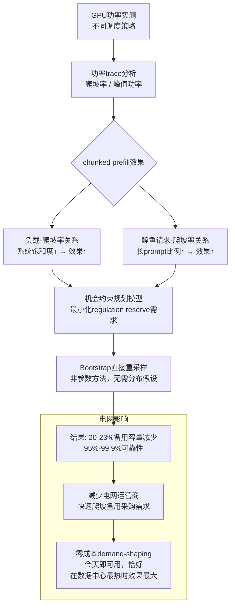

# Smoothing the Ramp, Not the Peak: Scheduling-Induced Power Dynamics of LLM Inference

> 📅 创建日期: 2026-08-07
> 🏷️ #LLM推理 #电力负荷 #数据中心 #爬坡率 #备用容量 #GPU功率
> ⭐ 价值评分: 8/10
> 📚 来源: [arXiv:2608.01250](https://arxiv.org/abs/2608.01250)

---

## 📌 解决了什么问题

LLM推理服务正在成为电网中增长最快的新电力负荷，但没人从电网规划的角度分析过它的功率动态特性。这篇论文用真实的GPU功率trace数据，揭示了LLM推理的一个"隐藏技能"：**chunked prefill调度**（一种为降低延迟而设计的调度策略）可以大幅平滑功率爬坡，从而减少电网备用容量需求——而且这是零成本的！

## 🧠 核心方法（方法论解读）

### 整体思路

先讲背景。LLM推理时有个"prefill阶段"——用户输入prompt后，模型一次性处理所有输入token，这个阶段GPU功率会瞬间飙到峰值。对于长prompt（比如输入一整篇论文），功率尖峰更猛烈。

**Chunked prefill**的本意是降低延迟：把长prompt拆成小块逐块处理，这样第一个token能更快生成。但这篇的洞察是：**分块处理不仅降延迟，还意外地把功率爬坡给平滑了**。

论文的核心发现链条：
1. 实测GPU功率 → 发现chunked prefill不降峰值功率，但降爬坡率（ramp rate）
2. 爬坡率的降幅随系统饱和度单调增长——负载越重，效果越好（轻载7%→重载34.6%）
3. "鲸鱼请求"（超长prompt）越多，效果越显著（可达42.6%）
4. 用bootstrap直接重采样实测trace，把爬坡率降低转换为电网regulation reserve需求的减少：在95%-99.9%可靠性水平下，可减少20.3%-22.7%的快速爬坡备用容量

这个发现的妙处在于：**这是今天已经部署在生产环境中的技术（chunked prefill），不需要任何硬件改造或额外成本**。

### 算法/模型框架

### 关键创新点

1. **首次从电网视角表征LLM推理的功率动态** — 之前没人把LLM serving当电力系统负荷来研究
2. **发现chunked prefill的"意外副作用"** — 降爬坡不降峰值，这一差异非常关键（很多直觉会猜峰值也降）
3. **负载-效果的正向单调性** — 越忙越有效，恰好和电网压力峰值对齐
4. **Bootstrap非参数方法** — 避免对功率分布做假设，直接用实测trace做机会约束

### 与已有方法的区别

| 方法 | 思路 | 局限性 |
|------|------|--------|
| 传统数据中心功率管理 | 限制峰值功率（power capping） | 牺牲性能，需要硬件支持 |
| 需求响应 | 价格信号引导负荷转移 | 需要市场机制，响应慢 |
| 电池储能平滑 | 用BESS吸收功率波动 | 昂贵，有循环寿命限制 |
| 本论文 chunked prefill | 用已有调度策略平滑爬坡 | 效果取决于工作负载特征，不能替代所有手段 |

---

## 🔬 实验设计

- **数据**: 真实GPU功率trace（实测），覆盖不同并发度、不同prompt长度
- **分析维度**: 系统饱和度（并发数）、鲸鱼请求（长prompt）比例和大小
- **电网影响量化**: Bootstrap直接重采样 + 机会约束规划 → regulation reserve需求变化
- **主要结果**:
  - 平均爬坡率降低：轻载7.0% → 重载34.6%（并发度维度）
  - 鲸鱼请求维度：从统计不显著 → 高比例时42.6%
  - 备用容量减少：20.3%-22.7%（95%→99.9%可靠性范围）

---

## 💡 为什么值得关注

这篇的视角很独特——**把AI推理调度当作电网需求侧管理工具**。而且不是"未来可能"而是"今天就能用"。

对你的研究来说：
- **数据中心参与电力市场的切入点**：如果你的研究涉及AI数据中心作为柔性负荷参与辅助服务市场，chunked prefill是你可以调用的一个"knob"
- **方法学**：Bootstrap直接重采样实测trace做机会约束——这对任何缺乏分布假设的功率不确定性建模都有参考价值
- **跨领域洞察**：这篇连接了两个通常不对话的圈子（系统调度+电力系统），这种跨领域视角本身就有价值

## ❓ 待思考的问题

- [ ] 论文分析了单个GPU → 扩展到整个数据中心（成百上千GPU）时，爬坡平滑效果是叠加还是抵消？
- [ ] chunk size的选择有一个trade-off：越小的chunk爬坡越平滑，但throughput可能下降。最优chunk size是多少？论文没讨论这点
- [ ] 电网运营商如何"看到"这个效果？需要什么样的测量/通信基础设施来把LLM调度器变成电网资源？
- [ ] 和你的研究方向结合：能否把chunked prefill建模为数据中心向电网提供的"爬坡服务"，从而在辅助服务市场中获得收益？
- [ ] 不同GPU架构（H100 vs B200 vs 未来）的功率特性差异是否会影响结论？

---

**最后更新**: 2026-08-07
