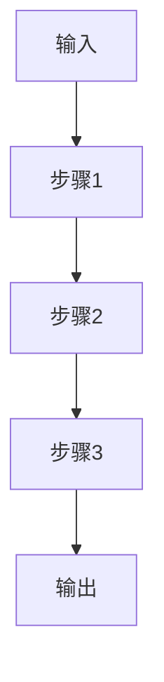

# {论文标题}

> 📅 创建日期: {日期}
> 🏷️ 标签: #{标签1} #{标签2}
> ⭐ 价值评分: {评分}/10
> 📚 来源: {链接/DOI}

---

## 📌 解决了什么问题

_用1-2句话概括这篇论文要解决的核心问题_

## 🧠 核心方法（方法论解读）

### 整体思路
_用通俗的语言描述这篇论文的核心思路，像一个师兄在跟你讲_

### 算法/模型框架

### 关键创新点
1. **创新1** — 简要说明
2. **创新2** — 简要说明
3. ...

### 与已有方法的区别
| 方法 | 思路 | 局限性 |
|------|------|--------|
| 传统方法A | ... | ... |
| 本论文 | ... | ... |

---

## 🔬 实验设计

- **数据集**: ...
- **基线方法**: ...
- **评价指标**: ...
- **主要结果**: ...

---

## 💡 为什么值得关注

_这篇论文的实验结果、思路、或者方向对你的研究有什么启发？_

## ❓ 待思考的问题

- [ ] 这个方法能否迁移到我的场景？
- [ ] 有什么可以改进的地方？
- [ ] 和其他论文的关联？

---

**最后更新**: {日期}
